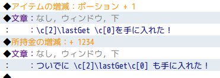
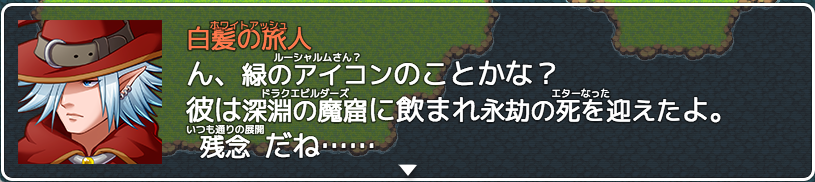

# ControlCharacter plugins

制御文字プラグイン集

## Torigoya_LastGet.js


### format
```
\lastGet を手に入れた！
```

## Torigoya_TextRuby.js


### format
```
\ruby[静止せし海の食物](お寿司)
\ruby[暗黒面]
```

### event command
登録するとよみがなを省略できます。

```
RubyDictionary 暗黒面 ダークサイド
```
