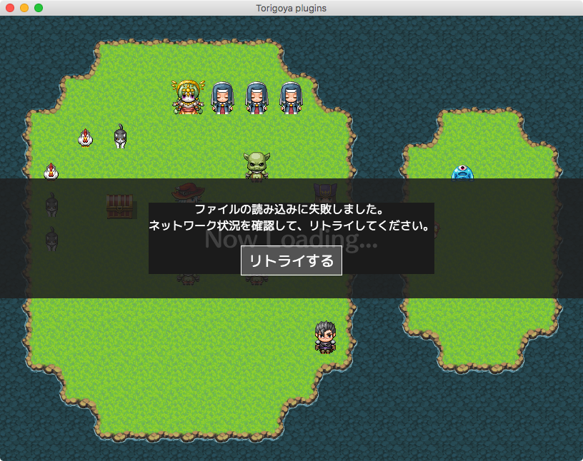

# Torigoya_CustomRetryMessage.js

RPGツクールMV用のプラグインです。

[RPGアツマール版コアスクリプト](http://blog.nicovideo.jp/atsumaru/atsumaru-corescript.html)のcommunity-1.2から導入された
ファイルのリトライ読み込み画面の表示を変更します。

## Blog
http://torigoya.hatenadiary.jp/entry/retry_load

----------

# Torigoya_RetryLoadPlus.js

**DEPRECATED**

RPGツクールMV用のプラグインです。
ファイルの読み込み失敗時にリトライ画面を表示します。

## Blog
http://torigoya.hatenadiary.jp/entry/retry_load
